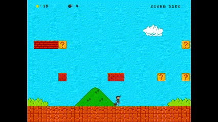
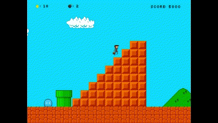
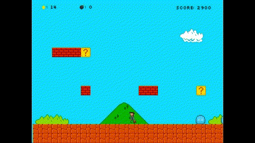

<strong>日本語版</strong>

# 就活生エリオ

「あれ？これは一体...。僕、エリオ、重要な就職面接の前に、わけ分かんない異世界に転送されてしまった。
遅刻なんて許されない、早く現実世界に戻らないと！」

いろんな意味でスーパーマリオに似ているゲームw。C++とSFMLによる開発。

## 環境 & ツール
- C++ 17
- Visual Studio 2022
- SFML 2.6.0 [ダウンロード](https://www.sfml-dev.org/download/sfml/2.6.0/)
- Aseprite (一部の素材) [ダウンロード](https://www.aseprite.org/)

## ゲーム操作
- 方向キー：移動またはジャンプ。
- LCTRL：爆弾を投げる（爆弾がある場合）
## ゲームプレイ
### 敵を倒せ！
ジャンプ攻撃あるいは爆弾攻撃で敵を倒せ！\

### 勝利
なんとなく現実世界に戻り、面接に間に合ったため、内定獲得！\

### 失敗
敵に潰された...もう間に合わない...\

## 素材
[Aseprite](https://www.aseprite.org/)で自制（一部）\
[bomb](https://www.flaticon.com/free-icons/bomb)\
[explosion](https://opengameart.org/content/explosion-set-1-m484-games)\
[explosion sound](http://creativecommons.org/licenses/by-sa/3.0/)\
[salaryman](https://opengameart.org/content/pixelated-employee-character)\
[fail sound](https://pixabay.com/sound-effects/kl-music-box-game-over-iii-152202/)\
[get item](https://pixabay.com/sound-effects/search/getitem/)\
[portal](https://opengameart.org/content/portals-32-x-48)\
[map materal](https://github.com/Kofybrek/Super-Mario-Bros/tree/Main/Source/Resources)\
[naitei](https://www.irasutoya.com/search?q=%E5%B0%B1%E6%B4%BB)\

# ERIO IS FINDING A JOB
 "Huh? Where am I...?  I, Erio, was suddenly transported to a different world (ISEKAI) right before an important job interview. I can't afford to be late, I have to return to the real world immediately!

A game that is similar to Super Mario from many aspects. Developed by C++ and SFML.

## Environment
- C++ 17
- Visual Studio 2022
- SFML 2.6.0 [Download link](https://www.sfml-dev.org/download/sfml/2.6.0/)
- Aseprite (part of the material) [Download link](https://www.aseprite.org/)

will add cmake later (maybe)

## How to Play
- Press Arry Keys to move or jump
- Press LCtrl to throw a bomb (if you have one)

## Game Play
### Crash your enemies!
Kill enemies with jump attack or bombs.

### Game Win
Erio got back to the interview in time, and got the offer successfully! Congratulations!

### Game Fail
Erio is defeated by the enemy, sad.

## Materials
Part of them are created or modified by myself using [Aseprite](https://www.aseprite.org/)\
[bomb](https://www.flaticon.com/free-icons/bomb)\
[explosion](https://opengameart.org/content/explosion-set-1-m484-games)\
[explosion sound](http://creativecommons.org/licenses/by-sa/3.0/)\
[salaryman](https://opengameart.org/content/pixelated-employee-character)\
[fail sound](https://pixabay.com/sound-effects/kl-music-box-game-over-iii-152202/)\
[get item](https://pixabay.com/sound-effects/search/getitem/)\
[portal](https://opengameart.org/content/portals-32-x-48)\
[map materal](https://github.com/Kofybrek/Super-Mario-Bros/tree/Main/Source/Resources)\
[naitei](https://www.irasutoya.com/search?q=%E5%B0%B1%E6%B4%BB)\